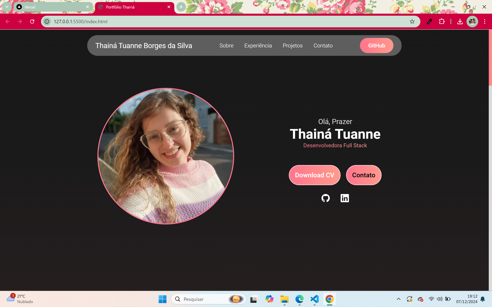

# Portfólio Profissional de Trabalho
Bem-vindo ao repositório do meu portfólio profissional! Este projeto foi criado para apresentar minhas habilidades, projetos e experiência profissional de maneira organizada e visualmente agradável.

## 🖥️ Sobre o Projeto

Este é um portfólio web que inclui:
- Informações sobre mim, minha experiência profissional e habilidades técnicas.
- Projetos que desenvolvi com detalhes sobre cada um.
- Um formulário de contato funcional que envia mensagens diretamente para meu e-mail.

O objetivo é demonstrar minhas habilidades em desenvolvimento web e criar um espaço para interação profissional.

## 🎨 Tecnologias Utilizadas

- **HTML5** e **CSS3** para estrutura e estilos.
- **JavaScript** para funcionalidades dinâmicas.
- **Node.js** e **Express.js** para o back-end (formulário de contato).
- **Nodemailer** para envio de e-mails.

## 🛠️ Funcionalidades

- **Interface responsiva**: Funciona bem em desktops, tablets e smartphones.
- **Formulário de contato funcional**: Envia mensagens diretamente para o meu e-mail.
- **Animações**: Adicionei efeitos com CSS (como `keyframes`) para uma experiência mais dinâmica.
- **Demonstração de projetos**: Exibição detalhada dos meus projetos concluídos.

- ### Página Inicial

